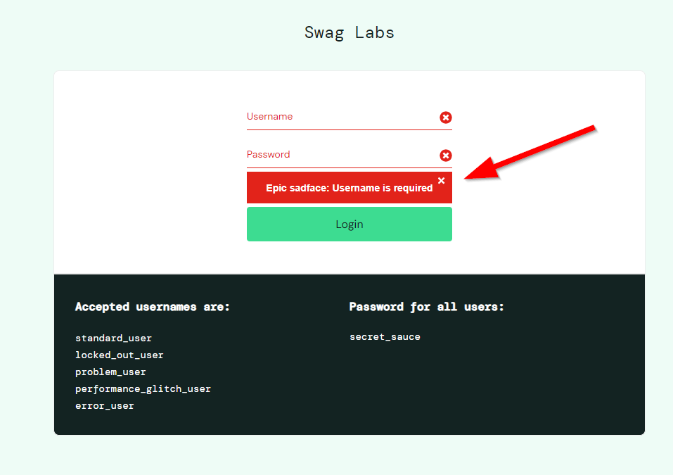

**Title:** In the login message when attempting to log in without providing a username and password.

**Description:**
When attempting to log in on the https://www.saucedemo.com/ website without providing a username and password, the current error message is: "Epic sadface: Username is required." However, the expected behavior is to display a message that reads: "Epic sadface: Username and password are required.".

**Steps to Reproduce:**
1. Open a web browser.
2. Go to the website https://www.saucedemo.com/.
3. Leave the "Username" and "Password" fields empty in the login section.
4. Click the "Login" button.

**Expected Behavior:**
The expected message is: "Epic sadface: Username and password are required."

**Current Behavior:**
The current message is: "Epic sadface: Username is required."

**Attachments:**

**Environment:** 
Google Chrome version 99.0 on Windows 10.

**Priority and Severity:**
Priority: Low
Severity: High - the incorrect message may lead to user confusion.

**Reported by:**
Konrad Mamla
Email: example@email.com
